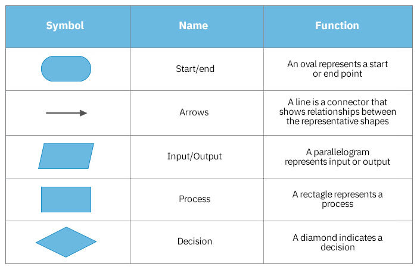

Teaching Team 
1. Ajarn Pat 2.Ajarn Tong 3.Ajarn Ohm

MFU LMS - https://lms.mfu.ac.th

Online editor - https://dotnetfiddle.net/

------------------
Example of Programing Language

- Low level language
- High Level Language (compiler Language)

Programer -> source Code -> Compiler -> Binary Machine Code -> Computer

" Algorithm is a representation of a solution to a problem.
  A computer program describes a computation procedure as algorithm.
  Algorithm is a swquence of instructions that describes how to perform a computation. "

**Lab01**
We write the C# file to print the string!
You can check that in day1.cs file in this directory.

Question file is -> CP2024_Lab01_Algorithm_IntroC#.docx
My submitted file is -> Lab01_6731501110.pdf