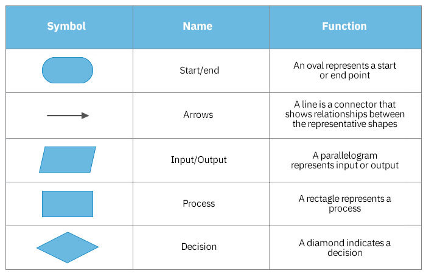

# University Notes

## Teaching Team
1. **Ajarn Pat**
2. **Ajarn Tong**
3. **Ajarn Ohm**

## Useful Links
- **MFU LMS:** [https://lms.mfu.ac.th](https://lms.mfu.ac.th)
- **Online Editor:** [https://dotnetfiddle.net/](https://dotnetfiddle.net/)

---

## Example of Programming Languages

- **Low-Level Language**
- **High-Level Language** (Compiler Language)

### The Programming Process

### Algorithm
> "An algorithm is a representation of a solution to a problem.  
> A computer program describes a computation procedure as an algorithm.  
> An algorithm is a sequence of instructions that describes how to perform a computation."

### Flowchart Symbols

---

## **Lab01**
In **Lab01**, we wrote a C# file to print a string.  
You can find the implementation in `day1.cs` file in this directory.

- **Question file:** `Resources/CP2024_Lab01_Algorithm_IntroC#.docx`
- **My submitted file:** `Resources/Lab01_6731501110.pdf`
